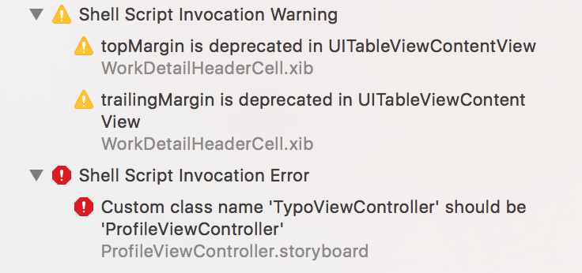

# IBLinter
[](https://travis-ci.org/IBDecodable/IBLinter)
[](https://developer.apple.com/swift/)

A linter tool to normalize `.xib` and `.storyboard` files. Inspired by [realm/SwiftLint](https://github.com/realm/SwiftLint)



## Installation

### Using [Homebrew](http://brew.sh/)

```sh
$ brew install IBDecodable/homebrew-tap/iblinter
```

### Using [CocoaPods](https://cocoapods.org)

```sh
pod 'IBLinter'
```

This will download the IBLinter binaries and dependencies in `Pods/` during your next
`pod install` execution and will allow you to invoke it via `${PODS_ROOT}/IBLinter/bin/iblinter`
in your Script Build Phases.

### Compiling from source

You can build from source by cloning this repository and running
```
$ make install
```
`iblinter` will be installed in `/usr/local/bin`.

## Usage

You can see all description by `iblinter help`

- `lint` prints lint warnings and errors (default command)
	- `--path` default is current directory.


### Xcode

Add a `Run Script Phase` to integrate IBLinter with Xcode

```sh
if which iblinter >/dev/null; then
  iblinter lint
else
  echo "warning: IBLinter not installed, download from https://github.com/IBDecodable/IBLinter"
fi
```

Alternatively, if you've installed IBLinter via CocoaPods the script should look like this:

```sh
"${PODS_ROOT}/IBLinter/bin/iblinter"
```

## Rules

| Rule id                        | description                                                                    |
|:-------------------------------|:-------------------------------------------------------------------------------|
| `custom_class_name`            | Custom class name of ViewController in storyboard should be same as file name. |
| `relative_to_margin`           | Forbid to use `relative to margin` option.                                     |
| `misplaced`                    | Display error when views are misplaced.                                        |
| `enable_autolayout`            | Force to use `useAutolayout` option                                            |
| `duplicate_constraint`         | Display warning when view has duplicated constraint.                           |
| `storyboard_viewcontroller_id` | Check that Storyboard ID same as ViewController class name.                    |
| `image_resources`              | Check if image resouces are valid.                                           |


Pull requests are encouraged.


## Configuration

You can configure IBLinter by adding a `.iblinter.yml` file from project root directory.


| key              | description              |
|:-----------------|:-------------------------|
| `enabled_rules`  | Enabled rules id.        |
| `disabled_rules` | Disabled rules id.       |
| `excluded`       | Path to ignore for lint. |


```yaml
enabled_rules:
  - relative_to_margin
disabled_rules:
  - custom_class_name
excluded:
  - Carthage
```
